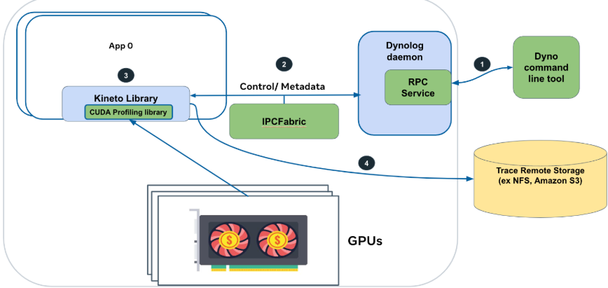

# MindStudio Monitor特性分析与设计说明书

<table>
    <tr>
        <td>所属SIG组:</td>
        <td>mstt-sig</td>
    </tr>
    <tr>
        <td>落入版本:</td>
        <td>MindStudio 26.0.0</td>
    </tr>
    <tr>
        <td>设计人员:</td>
        <td>chenhao</td>
    </tr>
    <tr>
        <td>日期:</td>
        <td>2026.01.21</td>
    </tr>
</table>

**Copyright © 2022 openGauss Community**

您对&quot;本文档&quot;的复制，使用，修改及分发受知识共享(Creative Commons)署名—相同方式共享4.0国际公共许可协议(以下简称&quot;CC BY-SA 4.0&quot;)的约束。
为了方便用户理解，您可以通过访问<https://creativecommons.org/licenses/by-sa/4.0/>了解CC BY-SA 4.0的概要 (但不是替代)。
CC BY-SA 4.0的完整协议内容您可以访问如下网址获取：<https://creativecommons.org/licenses/by-sa/4.0/legalcode>。

**改版记录**

<table>
    <tr>
        <th>日期</th>
        <th>修订版本</th>
        <th>修订描述</th>
        <th>作者</th>
        <th>审核</th>
    </tr>
    <tr>
        <td>2026.01.21</td>
        <td>1.0</td>
        <td>初稿完成</td>
        <td>chenhao</td>
        <td>chenhao</td>
    </tr>
</table>

# 1.特性概述

在线监控主要实现大模型集群场景下的性能监控和分析流程，轻量化打点监控来识别慢卡，再通过动态采集能力深度分析慢卡及相应通信域的慢卡根因快速定位和分析。

## 1.1范围

包含npumonitor的能力增强支持控制采集时段、采集数据范围的控制、nputrace的异步解析能力。

## 1.2特性需求列表

表1：特性需求列表

<table>
    <tr>
        <th>需求编号</th>
        <th>需求名称</th>
        <th>特性描述</th>
        <th>备注</th>
    </tr>
    <tr>
        <td>1</td>
        <td>npumonitor支持按Duration采集</td>
        <td>支持设置参数duration控制采集的时间段内的数据指标</td>
        <td>可由stop参数控制提前停止</td>  
    </tr>
    <tr>
        <td>2</td>
        <td>npumonitor支持按算子名采集</td>
        <td>支持设置算子名规则进行过滤需要的算子名称</td>
        <td>算子名称配置可基于模糊匹配</td>  
    </tr>
    <tr>
        <td>3</td>
        <td>nputrace支持异步解析能力</td>
        <td>支持解析线程异步处理数据</td>
        <td></td>  
    </tr>
</table>

# 2.需求场景分析

## 2.1特性需求来源与价值概述

msMonitor基础能力完善和加强，支持精细控制采集的数据范围，控制数据采集量级的同时可以支持自定义数据处理，灵活性及易用性更佳。

## 2.2特性场景分析

_描述该特性的业务使用场景_

_内容包括：_

1）场景触发条件及对象：什么角色/工具/接口等在什么具体情况下使用该特性，使用对象技能如何？

2）描述该特性主要有哪些用户应用场景、子场景及关键任务操作。_

## 2.3特性影响分析

_描述该特性在整个系统中的位置及周边接口。描述该特性有哪些关键约束或特性冲突。_

_与其他需求及特性的交互分析：_

_平台差异性分析：包括硬件平台和操作系统_

_兼容性分析：_

_约束及限制：_

### 2.3.1硬件限制

| 产品类型 | 支持情况 |
|---|---|
| Atlas A3系列训练/推理产品 | 支持 |
| Atlas A2系列训练/推理产品 | 支持 |

### 2.3.2技术限制

操作系统：linux

编程语言：C / Python

### 2.3.3对License的影响分析

NA

### 2.3.4对系统性能规格的影响分析

NA

### 2.3.5对系统可靠性规格的影响分析

NA

### 2.3.6对系统兼容性的影响分析

新增功能参数及能力，不涉及原有功能的变更，无兼容性问题。

### 2.3.7与其他重大特性的交互性，冲突性的影响分析

NA

## 2.4同类社区/商用软件实现方案分析

Dynolog 能够对分布式AI应用实施按需性能分析，且无需修改任何代码。用户可通过Dynolog服务发起PyTorch性能数据收集请求。接收到请求后，Dynolog会通过进程间通信（IPC）动态配置 PyTorch 性能分析器。

下图展示了该工作流程:



图1：社区方案实现图

1、配置PyTorch应用环境以启用按需追踪收集功能。

2、在本地或远程按需收集GPU追踪数据。

3、对分布式训练任务进行性能分析。

# 3.特性/功能实现原理(可分解出来多个Use Case)

## 3.1目标

_该章节主要描述特性在什么场景下要实现什么规格、达到什么目标_

## 3.2总体方案


图2：msMonitor方案总体逻辑架构视图

MindStudio基于分布式AI集群实现端到端解决方案：

**Dynolog System**：该系统为核心子系统，主要分成client、server两个模块。
Client侧发起指令使能轻量化打点监控能力，目前支持的参数有：nputrace（mstx/mspti详细打点信息） 、npumonitor（实时监控metrics，分析慢卡指标）Client命令参数交互使用RPC消息传递。
Server通过IPC Socket与业务进程内线程通信，转发Client侧下发的指令消息，通过组装和分发命令、配置到业务进程，进行使能/去使能等操作

**msProfiler**：训练业务进程内拉起轻量化打点监控线程进行周期性（Xs）读取mstx/mspti接口Buff的数据。轻量化打点监控线程通过IPC Socket向Daemon Server端上报打点数据

**msInsight/Analyzer**：用户/平台侧通过存储平台收集Metrics指标数据，集群节点数据依赖用户/平台的汇聚能力，汇聚后的数据支持调用知识库分析慢卡或可视化呈现。


图3：msMonitor交互上下文视图

msMonitor主要涉及的外部模块包括以下几个：

1、**开发者**：msMonitor提供命令行接口，支持动态采集自定义数据和开启预设监控数据的能力。开发者可通过配置快速获取集群性能数据。 msMonitor所在的环境为运行环境，开发人员可以进行配置、启停、分析等功能；

2、**Pytorch Profiler等算法框架**：基于Pytorch框架实现的数据采集能力。支持数据打点、采集等能力。提供框架层、CANN层性能数据，返回给监控系统进行下一步分析和展示

3、**MindX等AI平台**：作为运行平台可以调用命令行能力，可获取落盘数据进行二次分析/展示。也可以集成Insight可视化界面。

# 4.msMonitor采集基础参数能力实现

## 4.1设计思路

通过扩展子命令npumonitor的参数，以支持灵活控制采集的范围：

1、扩展参数--duration-ms 支持指定采集时间范围

2、扩展参数--filter 支持配置算子名筛选规则

## 4.2约束条件

NA

## 4.3详细实现(从用户入口的模块级别或进程级别消息序列图)

_本章节具体描述 __Use Case__ 实现过程。使用时序图、流程图描述各模块间的交互过程。_

_同时用简短文字说明时序图、流程图的各个模块分配需求的变化，尽量使用结构化的语言。_

## 4.4子系统间接口(主要覆盖模块接口定义)

_在这个章节只要说本次修改涉及哪个 __.h__ 的哪个接口的修改，大致的修改内容简述下即可。_

## 4.5子系统详细设计

_详细描述各模块的修改点。_

## 4.6DFX属性设计

### 4.6.1性能设计

本特性场景新增筛选规则控制会影响处理耗时，但是显著减少落盘数据量，有效降低I/O负载和耗时，性能影响可控。

### 4.6.2升级与扩容设计

参数新增特性不涉及升级和扩容场景。

### 4.6.3异常处理设计

参数合法有效性设计，需要控制并限制参数的设置范围和有效性检查的可靠性和韧性，避免异常参数影响业务主流程。

### 4.6.4资源管理相关设计

NA

### 4.6.5小型化设计

NA

### 4.6.6可测性设计

1、参数本身功能验证，包含duration时段采集是否失效、筛选规则是否生效

2、参数组合场景的验证，包含duration参数与stop参数的组合使用等

### 4.6.7 安全设计

#### 4.6.7.1 安全设计确认

*参考安全设计checklist进行确认*

| 安全属性     | 检查项                                                       | 检查项详细说明                                               | 是否涉及 | 是否满足 |
| ------------ | ------------------------------------------------------------ | ------------------------------------------------------------ |------|------|
| 访问通道控制 | 是否新增侦听端口                                             | 新增侦听端口需刷新通信矩阵                                   | 否    |      |
| 访问通道控制 | 是否新增进程或组件间通信                                     | 新增进程或组件间通信刷新通信矩阵                             | 否    |      |
| 访问通道控制 | 是否新增认证方式                                             | 新增认证方式需刷新通信矩阵及产品文档                         | 否    |      |
| 权限控制     | 是否涉及创建文件或目录                                       | 创建文件或目录须显式指定文件或目录的访问权限                 | 否    |      |
| 权限控制     | 账号权限是否满足"权限最小化原则"                             | 系统中各账号应赋予最小权限                                   | 否    |      |
| 权限控制     | 是否存在用户权限提升                                         | 禁止出现用户非法权限提升                                     | 否    |      |
| 未公开接口   | 是否新增GUC参数                                              | 新增GUC参数需刷新产品文档                                    | 否    |      |
| 未公开接口   | 是否新增或修改函数、视图、系统表                             | 新增或修改函数、视图、系统表需刷新产品文档，考虑权限控制     | 否    |      |
| 未公开接口   | 是否新增SQL语法                                              | 新增SQL语法需刷新产品文档，支持记录审计日志                  | 否    |      |
| 未公开接口   | 是否新增内部工具                                             | 新增内部工具需刷新产品文档                                   | 否    |      |
| 未公开接口   | 脚本中是否存在注释代码                                       | Shell/Python等解释性语言禁止注释代码，注释代码需要删除       | 否    |      |
| 未公开接口   | 是否存在隐藏命令、参数、端口等接入方式                       | 对于现网维护期间不会使用的命令/参数、端口等接入方式（包括但不限于产品的生产、调测、维护用途），必须删除（如通过编译宏） | 否    |      |
| 未公开接口   | 系统是否存在隐藏后门                                         | 禁止系统预留任何的未公开账号，所有账号必须可被系统管理，并在资料中予以说明 | 否    |      |
| 未公开接口   | 禁止在产品对外部用户发布的软件（包含软件包/补丁包）中提供破解类、网络嗅探类工具。 | 1、禁止在产品对外部用户发布的软件（包含软件包/补丁包）中提供可修改任意用户口令、具有“口令破解能力”（指口令暴力破解、利用系统/算法漏洞恶意破解口令）、对包含敏感数据的文件（如包含密钥的配置文件、数据库）进行解密的功能或工具。2、禁止在系统中保留第三方的网络嗅探工具tcpdump、gdb、strace、readelf网络、进程调试工具，cpp、gcc、dexdump、mirror、JDK开发/编译工具和仅在调测阶段使用的自研调试工具/脚本（例如：仅在调试阶段使用的加解密脚本、调测功能、可以提权的命令），由于业务需要必须保留的，需要进行严格的访问控制。同时在资料中说明保留的原因、使用的场景、风险。 | 否    |      |
| 敏感数据保护 | 认证凭据不允许明文存储在系统中，应该加密保护。               | 认证凭据（如口令/私钥等）不允许明文存储在系统中，应该加密保护。 | 否    |      |
| 敏感数据保护 | 用于敏感数据传输加密的密钥，不能硬编码在代码中。             | 禁止口令和密钥硬编码。                                       | 否    |      |
| 敏感数据保护 | 是否明文打印口令或密钥等敏感信息                             | 禁止在系统中存储的日志、调试信息、错误提示及ps命令等信息打印明文敏感信息（口令/私钥/预共享密钥）。 | 否    |      |
| 敏感数据保护 | 是否明文回显口令                                             | 禁止明文回显口令。                                           | 否    |      |
| 敏感数据保护 | 是否使用第三方和开源软件的缺省口令                           | 禁止使用第三方和开源软件的缺省口令，参考安全设计指南第1.5章节。 | 否    |      |
| 敏感数据保护 | 是否将密码明文存储在配置文件中                               | 明文密码不允许写入配置文件（命令行工具安装部署及使用时必需配置密码的场景除外）。 | 否    |      |
| 敏感数据保护 | 是否使用不安全的加密算法                                     | 禁止使用私有的或业界已知不安全的加密算法。推荐加密算法安全设计指南6.2章节。 | 否    |      |
| 敏感数据保护 | 口令等敏感信息是否使用安全的传输通道                         | 在非信任网络之间进行敏感信息传输须采用安全传输通道或者加密后传输。参考安全设计指南第10章。 | 否    |      |
| 敏感数据保护 | 内存中口令或密钥等敏感信息使用后是否销毁                     | 内存中的口令或密钥等信息使用完毕后立即清0。                  | 否    |      |
| 敏感数据保护 | 密码算法中使用到的随机数必须是密码学意义上的安全随机数。     | 密码算法中使用到的随机数必须是密码学意义上的安全随机数，参考安全设计指南6.3章节。 | 否    |      |
| 敏感数据保护 | 资料中是否存在不安全的示例                                   | 资料中的示例需要是安全的，对用户进行正确的引导，若示例中存在潜在的风险，要在资料中进行说明。 | 否    |      |
| 认证         | 是否提供认证机制                                             | 新系统需要提供认证机制并缺省开启。                           | 否    |      |
| 认证         | 认证是否在服务端进行                                         | 认证处理过程需要在服务端进行。                               | 否    |      |
| 认证         | 认证失败后服务端是否返回有效信息                             | 认证失败后，服务端返回信息不能提供详细的、可用于判断具体错误原因的提示。 | 否    |      |
| 外部参数校验 | 是否对外部输入进行合法性校验                                 | 1、使用外部输入数据作为循环终止条件、数组下标、内存分配大小参数等，可能导致系统出现死循环、缓冲区溢出、内存越界、拒绝服务等一系列行为。2、文件路径等外部输入应进行合法性校验，防止注入风险 | 是    | 是    |
| 三方件引入   | 是否新引入三方组件                                           | 1.新增三方组件需要通过安全编译选项、病毒、漏洞、开源片段引用、license合规、开源组件扫描，参考版本发布网络安全质量要求。2.新增三方组件需保证来源可信。 | 是    | 是    |

#### 4.6.7.2 敏感数据分析

##### 1. 敏感数据清单

*敏感数据的具体范围取决于系统具体的应用场景，设计者应根据风险锦绣分析和判断。典型的敏感数据包括认证凭据（如口令）、密钥等内容。*

| **数据字段**    | **备注/说明**          | **数据字段敏感度** | **关联处理模块** | **强制的操作**             | **禁止的操作** |
| --------------- | ---------------------- | ------------------ | ---------------- | -------------------------- | -------------- |
| 管理员账号/密码 | 系统管理员的账号和密码 | 高                 | 登陆/认证        | 加密传输/加密存储/匿名化等 | 回显/日志等    |
| ...             | ...                    | ...                | ...              | ...                        | ...            |
|                 |                        |                    |                  |                            |                |

##### 2. 敏感操作检查

*1）生命周期维度*
*对于识别出的敏感数据，我们需要完整的识别出数据的生命周期，识别“产生、使用、传输、持久化和销毁”的过程，以避免后续风险识别过程中无意的疏漏。*
*2）高风险处理过程*
*识别对敏感数据的处理过程中，是否有高风险的处理。典型的高风险处理包括：“打印”，“回显”，“存储”，“硬编码”，以及“不安全算法”。从信息处理的角度出发，这些高风险的处理过程在处理敏感数据时，容易产生安全漏洞，需要详细检查，对于识别到的多个敏感数据均需要进行检查，敏感数据检查矩阵如下：*

例如，在典型的Web系统中，识别到的敏感数据（管理员账号/密码）在其生命周期的检查结果如下：

- 产生：由管理员首次登陆系统设置密码
- 使用：管理员登陆系统时使用密码进行认证
- 传输：管理员在客户端输入登陆密码后，密码通过网络传输至服务端
- 持久化：管理员首次设置密码后，服务端将密码持久化在后端数据库中
- 销毁：超过一定周期后，强制管理员修改密码，将旧密码删除

|            |                             产生                             |                  使用                  |                        传输                        |       持久化       |                 销毁                 |
| :--------: | :----------------------------------------------------------: | :------------------------------------: | :------------------------------------------------: | :----------------: | :----------------------------------: |
|    打印    |                            不涉及                            | 使用过程中不会将密码进行任何形式的打印 | 安全传输通道下不需要加密；非安全传输通道下加密传输 |       不涉及       | 销毁过程不打印密码，但需记录操作日志 |
|    回显    |            在客户端密文回显，口令显示为*********             |                 不涉及                 |                       不涉及                       |       不涉及       |                不涉及                |
|    存储    | 用户输入设置密码后，会通过安全加密算法将密码加密保存至后端数据库 |               同【产生】               |                       不涉及                       | 后端数据库加密存储 |    从后端数据库 表中删除对应密码     |
|   硬编码   |                            不涉及                            |                 不涉及                 |                       不涉及                       |       不涉及       |                不涉及                |
| 不安全算法 |                  使用安全算法（AES256）加密                  |            使用时内存中解密            |           非安全传输通道使用安全加密算法           |     同【产生】     |                不涉及                |

#### 4.6.7.3 设计实现

通过扩展子命令npumonitor的参数，以支持灵活控制采集的范围：

```rust
    NpuMonitor {
        /// Start NPU monitor.
        #[clap(long, action)]
        npu_monitor_start: bool,
        /// Stop NPU monitor.
        #[clap(long, action)]
        npu_monitor_stop: bool,
        /// NPU monitor report interval in seconds.
        #[clap(long, default_value_t = 60)]
        report_interval_s: u32,
        /// NPU monitor collect duration in seconds.
        #[clap(long, value_parser = parse_duration, default_value_t = 0.0)]
        duration: f32,
        /// MSPTI collect activity kind
        #[clap(long, value_parser = parse_mspti_activity_kinds, default_value = "Marker")]
        mspti_activity_kind: String,
        /// Log file for NPU monitor.
        #[clap(long, default_value = "")]
        log_file: String,
        /// Export type for NPU monitor.
        #[clap(long, value_parser = ["DB", "Jsonl"], default_value = "DB")]
        export_type: String,
        /// Filter for NPU monitor.
        #[clap(long, value_parser = validate_string_max_len, default_value = "")]
        filter: String,
    }
```

- 扩展参数--duration-ms 支持指定采集时间范围

- 扩展参数--filter 支持配置算子名筛选规则

## 4.7系统外部接口

_是否会影响到系统外部接口，包括 __guc__ 参数、工具使用方式、 __SQL__ 语法、网络协议、系统表视图函数、驱动（ __JDBC/ODBC__ ）等_

## 4.8自测用例设计

_描述自测用例是如何设计的，如何测试保证功能符合预期_

# 5.msMonitor采集异步解析能力实现

## 5.1设计思路

通过扩展子命令nputrace的参数，以支持控制异步解析流程：

1、扩展参数--async-mode 支持通过独立子进程进行数据解析处理，并行处理避免阻塞业务流程。

## 5.2约束条件

NA

## 5.3详细实现(从用户入口的模块级别或进程级别消息序列图)

_本章节具体描述 __Use Case__ 实现过程。使用时序图、流程图描述各模块间的交互过程。_

_同时用简短文字说明时序图、流程图的各个模块分配需求的变化，尽量使用结构化的语言。_

## 5.4子系统间接口(主要覆盖模块接口定义)

_在这个章节只要说本次修改涉及哪个 __.h__ 的哪个接口的修改，大致的修改内容简述下即可。_

## 5.5子系统详细设计

_详细描述各模块的修改点。_

## 5.6DFX属性设计

### 5.6.1性能设计

本特性场景新增异步解析能力，从主进程迁移子进程近些年数据处理，性能影响可控。

### 5.6.2升级与扩容设计

参数新增特性不涉及升级和扩容场景。

### 5.6.3异常处理设计

参数合法有效性设计，需要控制并限制参数的设置范围和有效性检查的可靠性和韧性，避免异常参数影响业务主流程。

### 5.6.4资源管理相关设计

NA 

### 5.6.5小型化设计

NA

### 5.6.6可测性设计

1、参数本身功能验证，包含异步解析能力是否生效。

### 5.6.7 安全设计

#### 5.6.7.1 安全设计确认

*参考安全设计checklist进行确认*

| 安全属性     | 检查项                                                       | 检查项详细说明                                               | 是否涉及 | 是否满足 |
| ------------ | ------------------------------------------------------------ | ------------------------------------------------------------ |------|------|
| 访问通道控制 | 是否新增侦听端口                                             | 新增侦听端口需刷新通信矩阵                                   | 否    |      |
| 访问通道控制 | 是否新增进程或组件间通信                                     | 新增进程或组件间通信刷新通信矩阵                             | 否    |      |
| 访问通道控制 | 是否新增认证方式                                             | 新增认证方式需刷新通信矩阵及产品文档                         | 否    |      |
| 权限控制     | 是否涉及创建文件或目录                                       | 创建文件或目录须显式指定文件或目录的访问权限                 | 否    |      |
| 权限控制     | 账号权限是否满足"权限最小化原则"                             | 系统中各账号应赋予最小权限                                   | 否    |      |
| 权限控制     | 是否存在用户权限提升                                         | 禁止出现用户非法权限提升                                     | 否    |      |
| 未公开接口   | 是否新增GUC参数                                              | 新增GUC参数需刷新产品文档                                    | 否    |      |
| 未公开接口   | 是否新增或修改函数、视图、系统表                             | 新增或修改函数、视图、系统表需刷新产品文档，考虑权限控制     | 否    |      |
| 未公开接口   | 是否新增SQL语法                                              | 新增SQL语法需刷新产品文档，支持记录审计日志                  | 否    |      |
| 未公开接口   | 是否新增内部工具                                             | 新增内部工具需刷新产品文档                                   | 否    |      |
| 未公开接口   | 脚本中是否存在注释代码                                       | Shell/Python等解释性语言禁止注释代码，注释代码需要删除       | 否    |      |
| 未公开接口   | 是否存在隐藏命令、参数、端口等接入方式                       | 对于现网维护期间不会使用的命令/参数、端口等接入方式（包括但不限于产品的生产、调测、维护用途），必须删除（如通过编译宏） | 否    |      |
| 未公开接口   | 系统是否存在隐藏后门                                         | 禁止系统预留任何的未公开账号，所有账号必须可被系统管理，并在资料中予以说明 | 否    |      |
| 未公开接口   | 禁止在产品对外部用户发布的软件（包含软件包/补丁包）中提供破解类、网络嗅探类工具。 | 1、禁止在产品对外部用户发布的软件（包含软件包/补丁包）中提供可修改任意用户口令、具有“口令破解能力”（指口令暴力破解、利用系统/算法漏洞恶意破解口令）、对包含敏感数据的文件（如包含密钥的配置文件、数据库）进行解密的功能或工具。2、禁止在系统中保留第三方的网络嗅探工具tcpdump、gdb、strace、readelf网络、进程调试工具，cpp、gcc、dexdump、mirror、JDK开发/编译工具和仅在调测阶段使用的自研调试工具/脚本（例如：仅在调试阶段使用的加解密脚本、调测功能、可以提权的命令），由于业务需要必须保留的，需要进行严格的访问控制。同时在资料中说明保留的原因、使用的场景、风险。 | 否    |      |
| 敏感数据保护 | 认证凭据不允许明文存储在系统中，应该加密保护。               | 认证凭据（如口令/私钥等）不允许明文存储在系统中，应该加密保护。 | 否    |      |
| 敏感数据保护 | 用于敏感数据传输加密的密钥，不能硬编码在代码中。             | 禁止口令和密钥硬编码。                                       | 否    |      |
| 敏感数据保护 | 是否明文打印口令或密钥等敏感信息                             | 禁止在系统中存储的日志、调试信息、错误提示及ps命令等信息打印明文敏感信息（口令/私钥/预共享密钥）。 | 否    |      |
| 敏感数据保护 | 是否明文回显口令                                             | 禁止明文回显口令。                                           | 否    |      |
| 敏感数据保护 | 是否使用第三方和开源软件的缺省口令                           | 禁止使用第三方和开源软件的缺省口令，参考安全设计指南第1.5章节。 | 否    |      |
| 敏感数据保护 | 是否将密码明文存储在配置文件中                               | 明文密码不允许写入配置文件（命令行工具安装部署及使用时必需配置密码的场景除外）。 | 否    |      |
| 敏感数据保护 | 是否使用不安全的加密算法                                     | 禁止使用私有的或业界已知不安全的加密算法。推荐加密算法安全设计指南6.2章节。 | 否    |      |
| 敏感数据保护 | 口令等敏感信息是否使用安全的传输通道                         | 在非信任网络之间进行敏感信息传输须采用安全传输通道或者加密后传输。参考安全设计指南第10章。 | 否    |      |
| 敏感数据保护 | 内存中口令或密钥等敏感信息使用后是否销毁                     | 内存中的口令或密钥等信息使用完毕后立即清0。                  | 否    |      |
| 敏感数据保护 | 密码算法中使用到的随机数必须是密码学意义上的安全随机数。     | 密码算法中使用到的随机数必须是密码学意义上的安全随机数，参考安全设计指南6.3章节。 | 否    |      |
| 敏感数据保护 | 资料中是否存在不安全的示例                                   | 资料中的示例需要是安全的，对用户进行正确的引导，若示例中存在潜在的风险，要在资料中进行说明。 | 否    |      |
| 认证         | 是否提供认证机制                                             | 新系统需要提供认证机制并缺省开启。                           | 否    |      |
| 认证         | 认证是否在服务端进行                                         | 认证处理过程需要在服务端进行。                               | 否    |      |
| 认证         | 认证失败后服务端是否返回有效信息                             | 认证失败后，服务端返回信息不能提供详细的、可用于判断具体错误原因的提示。 | 否    |      |
| 外部参数校验 | 是否对外部输入进行合法性校验                                 | 1、使用外部输入数据作为循环终止条件、数组下标、内存分配大小参数等，可能导致系统出现死循环、缓冲区溢出、内存越界、拒绝服务等一系列行为。2、文件路径等外部输入应进行合法性校验，防止注入风险 | 是    | 是    |
| 三方件引入   | 是否新引入三方组件                                           | 1.新增三方组件需要通过安全编译选项、病毒、漏洞、开源片段引用、license合规、开源组件扫描，参考版本发布网络安全质量要求。2.新增三方组件需保证来源可信。 | 是    | 是    |

#### 5.6.7.2 敏感数据分析

##### 1. 敏感数据清单

*敏感数据的具体范围取决于系统具体的应用场景，设计者应根据风险锦绣分析和判断。典型的敏感数据包括认证凭据（如口令）、密钥等内容。*

| **数据字段**    | **备注/说明**          | **数据字段敏感度** | **关联处理模块** | **强制的操作**             | **禁止的操作** |
| --------------- | ---------------------- | ------------------ | ---------------- | -------------------------- | -------------- |
| 管理员账号/密码 | 系统管理员的账号和密码 | 高                 | 登陆/认证        | 加密传输/加密存储/匿名化等 | 回显/日志等    |
| ...             | ...                    | ...                | ...              | ...                        | ...            |
|                 |                        |                    |                  |                            |                |

##### 2. 敏感操作检查

*1）生命周期维度*
*对于识别出的敏感数据，我们需要完整的识别出数据的生命周期，识别“产生、使用、传输、持久化和销毁”的过程，以避免后续风险识别过程中无意的疏漏。*
*2）高风险处理过程*
*识别对敏感数据的处理过程中，是否有高风险的处理。典型的高风险处理包括：“打印”，“回显”，“存储”，“硬编码”，以及“不安全算法”。从信息处理的角度出发，这些高风险的处理过程在处理敏感数据时，容易产生安全漏洞，需要详细检查，对于识别到的多个敏感数据均需要进行检查，敏感数据检查矩阵如下：*

例如，在典型的Web系统中，识别到的敏感数据（管理员账号/密码）在其生命周期的检查结果如下：

- 产生：由管理员首次登陆系统设置密码
- 使用：管理员登陆系统时使用密码进行认证
- 传输：管理员在客户端输入登陆密码后，密码通过网络传输至服务端
- 持久化：管理员首次设置密码后，服务端将密码持久化在后端数据库中
- 销毁：超过一定周期后，强制管理员修改密码，将旧密码删除

|            |                             产生                             |                  使用                  |                        传输                        |       持久化       |                 销毁                 |
| :--------: | :----------------------------------------------------------: | :------------------------------------: | :------------------------------------------------: | :----------------: | :----------------------------------: |
|    打印    |                            不涉及                            | 使用过程中不会将密码进行任何形式的打印 | 安全传输通道下不需要加密；非安全传输通道下加密传输 |       不涉及       | 销毁过程不打印密码，但需记录操作日志 |
|    回显    |            在客户端密文回显，口令显示为*********             |                 不涉及                 |                       不涉及                       |       不涉及       |                不涉及                |
|    存储    | 用户输入设置密码后，会通过安全加密算法将密码加密保存至后端数据库 |               同【产生】               |                       不涉及                       | 后端数据库加密存储 |    从后端数据库 表中删除对应密码     |
|   硬编码   |                            不涉及                            |                 不涉及                 |                       不涉及                       |       不涉及       |                不涉及                |
| 不安全算法 |                  使用安全算法（AES256）加密                  |            使用时内存中解密            |           非安全传输通道使用安全加密算法           |     同【产生】     |                不涉及                |

#### 5.6.7.3 设计实现

通过扩展子命令npumonitor的参数，以支持灵活控制采集的范围：

```rust
    Nputrace {
        /// Job id of the application to trace.
        #[clap(long, default_value_t = 0)]
        job_id: u64,
        /// List of pids to capture trace for (comma separated).
        #[clap(long, value_parser = validate_string_max_len, default_value = "0")]
        pids: String,
        /// Duration of trace to collect in ms.
        #[clap(long, default_value_t = 500)]
        duration_ms: u64,
        /// Training iterations to collect, this takes precedence over duration.
        #[clap(long, value_parser = parse_iterations, allow_negative_numbers = true)]
        iterations: i64,
        /// Log file for trace.
        #[clap(long)]
        log_file: String,
        /// Unix timestamp used for synchronized collection (milliseconds since epoch).
        #[clap(long, default_value_t = 0)]
        profile_start_time: u64,
        /// Number of steps to start profile, -1 means start from next step.
        #[clap(long, value_parser = parse_start_step, allow_negative_numbers = true)]
        start_step: i64,
        /// Max number of processes to profile.
        #[clap(long, default_value_t = 3)]
        process_limit: u32,
        /// Whether to record PyTorch operator input shapes and types.
        #[clap(long, action)]
        record_shapes: bool,
        /// Whether to profile PyTorch memory.
        #[clap(long, action)]
        profile_memory: bool,
        /// Whether to profile the Python call stack in trace.
        #[clap(long, action)]
        with_stack: bool,
        /// Annotate operators with analytical flops.
        #[clap(long, action)]
        with_flops: bool,
        /// Whether to profile PyTorch operator modules in traces.
        #[clap(long, action)]
        with_modules: bool,
        /// The scope of the profile's events.
        #[clap(long, value_parser = ["CPU,NPU", "NPU,CPU", "CPU", "NPU"], default_value = "CPU,NPU")]
        activities: String,
        /// Profiler level.
        #[clap(long, value_parser = ["Level0", "Level1", "Level2", "Level_none"], default_value = "Level0")]
        profiler_level: String,
        /// AIC metrics.
        #[clap(long, value_parser = ["AiCoreNone", "PipeUtilization", "ArithmeticUtilization", "Memory", "MemoryL0", "ResourceConflictRatio", "MemoryUB", "L2Cache", "MemoryAccess"], default_value = "AiCoreNone")]
        aic_metrics: String,
        /// Whether to analyse the data after collection.
        #[clap(long, action)]
        analyse: bool,
        /// Whether to enable async mode.
        #[clap(long, action)]
        async_mode: bool,
        /// Whether to collect L2 cache.
        #[clap(long, action)]
        l2_cache: bool,
        /// Whether to collect op attributes.
        #[clap(long, action)]
        op_attr: bool,
        /// Whether to enable MSTX.
        #[clap(long, action)]
        msprof_tx: bool,
        /// GC detect threshold.
        #[clap(long)]
        gc_detect_threshold: Option<f32>,
        /// Whether to streamline data after analyse is complete.
        #[clap(long, value_parser = ["true", "false"], default_value = "true")]
        data_simplification: String,
        /// Types of data exported by the profiler.
        #[clap(long, value_parser = ["Text", "Db"], default_value = "Text")]
        export_type: String,
        /// Obtain the system data on the host side.
        #[clap(long, value_parser = parse_host_sys, default_value = "None")]
        host_sys: String,
        /// Whether to enable sys io.
        #[clap(long, action)]
        sys_io: bool,
        /// Whether to enable sys interconnection.
        #[clap(long, action)]
        sys_interconnection: bool,
        /// The domain that needs to be enabled in mstx mode.
        #[clap(long)]
        mstx_domain_include: Option<String>,
        /// Domains that do not need to be enabled in mstx mode.
        #[clap(long)]
        mstx_domain_exclude: Option<String>,
    }
```

- 扩展参数--async-mode 支持异步解析能力

## 5.7系统外部接口

_是否会影响到系统外部接口，包括 __guc__ 参数、工具使用方式、 __SQL__ 语法、网络协议、系统表视图函数、驱动（ __JDBC/ODBC__ ）等_

## 5.8自测用例设计

_描述自测用例是如何设计的，如何测试保证功能符合预期_

# 6.可靠性&可用性设计

## 6.1冗余设计

NA

## 6.2故障管理

NA

## 6.3过载控制设计

NA

## 6.4升级不中断业务

_特性内部的升级不中断业务，主要考虑特性在不同软件版本的消息兼容、配置数据格式兼容、接口兼容、与周边特性的相互依赖，以及升级失败时的快速回退处理过程。_

## 6.5人因差错设计

NA

## 6.6故障预测预防设计

_特性应配合系统故障预测预防能力提供相关的数据采集和统计接口。比如磁盘空间检测等。_

# 7.特性非功能性质量属性相关设计

## 7.1可测试性

_重点从特性在测试的方向和规格上展开描述，说明在测试人员测试时应该测哪些方面，需要注意哪些边界值、异常值、异常场景。_

## 7.2可服务性

_对特性提供丰富的可维护可服务的措施，提供对特性的使用、维护、问题处理等的完整资料说明。_

## 7.3可演进性

_重点从特性架构、功能的可演进性上展开描述。_

## 7.4开放性

_重点描述特性的对外接口开放性，包括接口的规范性，比如符合 __SQL 2011__ 标准。_

## 7.5兼容性

_重点描述特性是否会影响系统的前向兼容性，即旧功能在升级新版本之后是否可使用，使用行为是否和旧版本保持一致。_

## 7.6可伸缩性/可扩展性

_有效满足系统容量变化的要求，包括数据库节点的扩缩容、数据库服务器本身的扩缩容。_

## 7.7可维护性

_重点从特性的可维护性展开描述，比如诊断视图、 __log__ 打印等。_

# 8.数据结构设计（可选）

_本章节完成数据库结构的设计（数据库系统表结构，可以使用 __Power Designer__ 完成），可选章节。_
