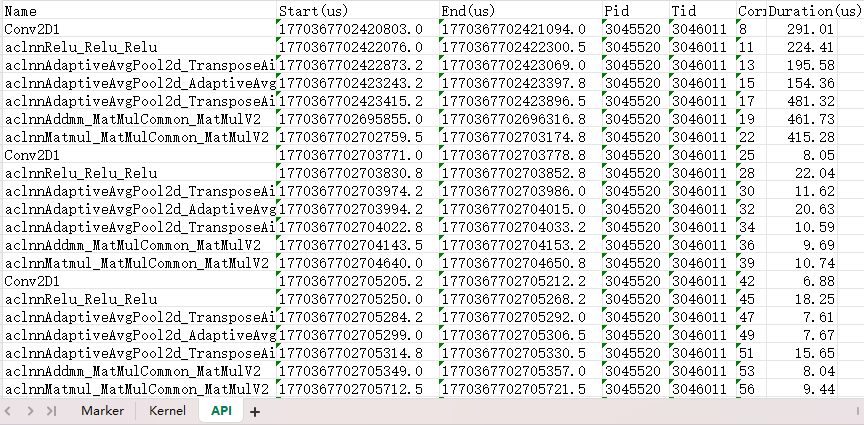

# Monitor

## 简介

Monitor 是集成在MindStudio Monitor中的一套接口，用户可以通过调用这些接口来开启、停止性能监控，以及获取监控数据。

## 使用前准备

安装msMonitor工具。详情请参见《[msMonitor工具安装指南](./install_guide.md)》，推荐使用下载软件包安装。

## Monitor功能介绍

**功能说明**

提供简单易用接口，采集计算类算子、通信类算子、API、Runtime API、Mstx等性能数据，用户可以根据需要选择采集的指标。

**接口说明**

参考mindstudio_monitor的[Monitor特性接口说明](mindstudio_monitor_api_reference.md#monitor特性接口说明)。

**使用示例**

1. 在模型 Python 脚本中引入 Monitor 接口。

   ```python
   from msmonitor import Monitor, ActivityKind
   ```

2. 在模型 Python 脚本中调用 Monitor 接口启动性能监控。

   ```python
   import torch
   import torch.nn as nn

   class FeatureExtractor(nn.Module):

       def __init__(self, in_channels=3, out_channels=16, kernel_size=3):
           super(FeatureExtractor, self).__init__()
           self.conv = nn.Conv2d(in_channels, out_channels, kernel_size, stride=1, padding=1)
           self.relu = nn.ReLU()
           self.pool = nn.AdaptiveAvgPool2d((4, 4))

       def forward(self, x):
           x = self.conv(x)
           x = self.relu(x)
           x = self.pool(x)
           return x

   from msmonitor import Monitor, ActivityKind

   # 开启性能监控
   monitor = Monitor()
   monitor.start(kinds=[
       ActivityKind.API,
       ActivityKind.Kernel,
       ActivityKind.Marker
   ])

   # 模型运行
   batch_size = 4
   input_tensor = torch.randn(batch_size, 3, 32, 32).npu()
   extractor = FeatureExtractor(in_channels=3, out_channels=16, kernel_size=3).npu()
   linear_layer = nn.Linear(in_features=256, out_features=128).npu()

   for i in range(10):
       range_id = torch.npu.mstx.range_start(f"step {i}", torch.npu.current_stream())
       features = extractor(input_tensor)
       flat_features = features.view(batch_size, -1)
       x = linear_layer(flat_features)
       w = torch.randn(128, 64).npu()
       y = torch.matmul(x, w)
       torch.npu.mstx.range_end(range_id)

   torch.npu.synchronize()

   # 停止性能监控
   monitor.stop()

   # （可选）在线获取性能数据，参考步骤3
   result = monitor.get_result()

   # （可选）将性能数据保存到本地文件，参考步骤4
   monitor.save("monitor_result.xlsx")
   ```

3. （可选）可通过在线方式获取性能数据，返回的数据结构请参考[ActivityData数据结构](mindstudio_monitor_api_reference.md#activitydata数据结构)。

   ```python
   # 获取性能数据并打印
   result = monitor.get_result()
   for kind, data in result.items():
       for item in data:
           print(f"kind: {kind}, name: {item.name}, durationNs: {item.endNs-item.startNs}")
   ```

4. （可选）将性能数据保存到本地文件，当前仅支持Excel格式， 文件详细介绍请参见[输出结果文件说明](#输出结果文件说明)。

   ```python
   # 将性能数据保存到本地文件
   monitor.save("monitor_result.xlsx")
   ```

## 输出结果文件说明

落盘的 Excel 文件包含多个 Sheet 页，每个 Sheet 页对应一种采集的数据类型，例如 API、Kernel、Marker 等，用户可通过查看不同 Sheet 页来分析算子、API的执行耗时情况。

如下图所示：



各个Sheet页的字段说明如下：

### Marker

* `Name`: mstx打点消息内容
* `SourceKind`: 消息来源类型，"Host" 或 "Device"
* `Domain`: 消息所属 domain 名称
* `ID`: 消息ID
* `Start(us)`: mstx打点开始时间，单位：us
* `End(us)`: mstx打点结束时间，单位：us
* `Pid`: SourceKind 为 "Host" 时为进程ID，为 "Device" 时为 0
* `Tid`: SourceKind 为 "Host" 时为线程ID，为 "Device" 时为 0
* `Device ID`: SourceKind 为 "Device" 时为marker所属设备ID，为 "Host" 时为 0
* `Stream ID`: SourceKind 为 "Device" 时为marker所属流ID，为 "Host" 时为 0
* `Duration(us)`: mstx打点执行时间，单位：us

### Kernel

* `Name`: 计算类算子名称
* `Start(us)`: 算子执行开始时间，单位：us
* `End(us)`: 算子执行结束时间，单位：us
* `Device ID`: 算子执行所在的设备ID
* `Stream ID`: 算子执行所在的流ID
* `Correlation ID`: 算子执行关联ID，用于和API数据关联
* `Type`: 算子类型，例如 "KERNEL_AICORE"、"KERNEL_AIVEC"、"KERNEL_AICPU" 等
* `Duration(us)`: 算子执行时间，单位：us

### Communication

* `Name`: 通信类算子名称
* `Start(us)`: 算子执行开始时间，单位：us
* `End(us)`: 算子执行结束时间，单位：us
* `Device ID`: 算子执行所在的设备ID
* `Stream ID`: 算子执行所在的流ID
* `Count`: 算子传输的数据量
* `DataType`: 算子传输的数据类型，例如 "FP32"、"INT8" 等
* `CommName`: 算子所属通信域名称
* `AlgType`: 算子所属通信算法类型，例如 "RING"、"MESH" 等
* `Correlation ID`: 算子执行关联ID，用于和API数据关联
* `Duration(us)`: 算子执行时间，单位：us

### API、AclAPI、NodeAPI、RuntimeAPI

* `Name`: API 名称
* `Start(us)`: API 调用开始时间，单位：us
* `End(us)`: API 调用结束时间，单位：us
* `Pid`: 调用 API 的进程ID
* `Tid`: 调用 API 的线程ID
* `Correlation ID`: API 调用关联ID，用于和Kernel/Communication数据关联
* `Duration(us)`: API 调用时间，单位：us
